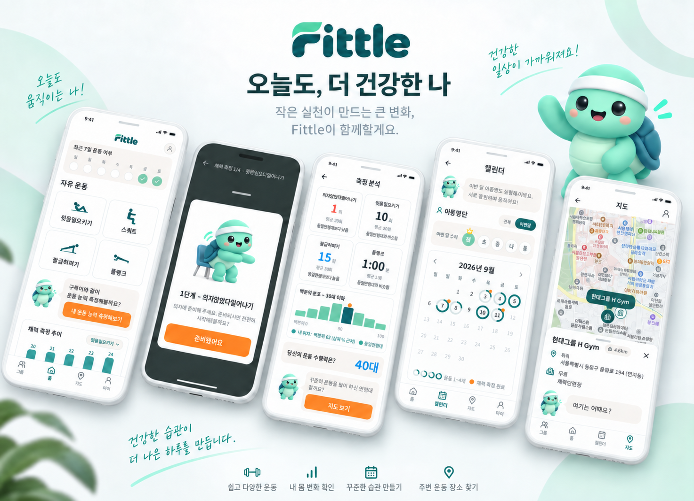
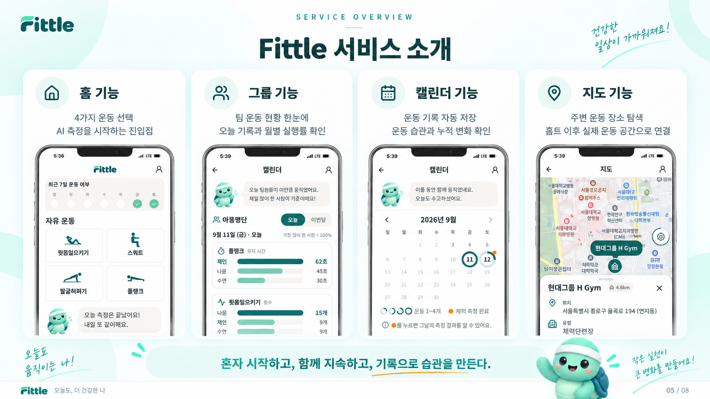
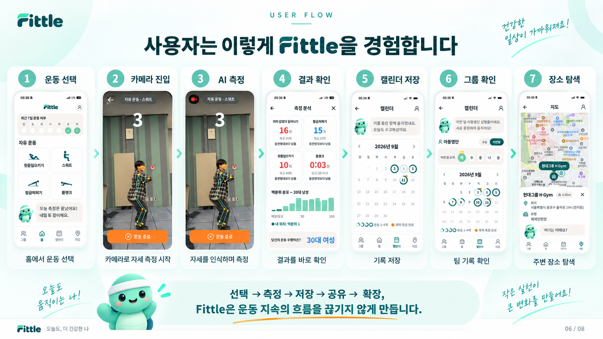
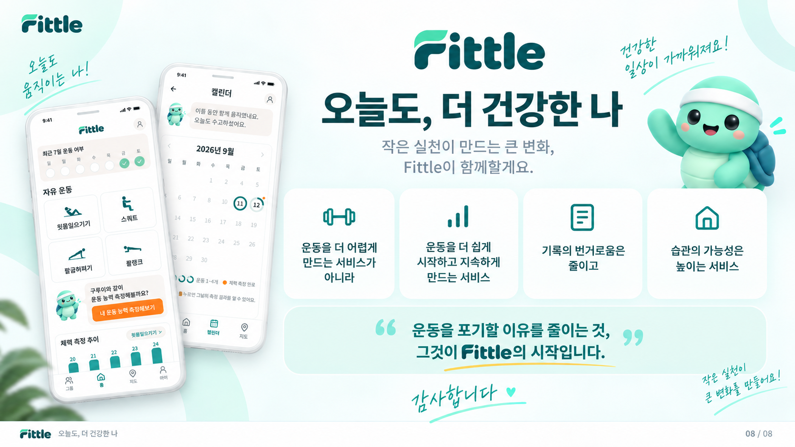
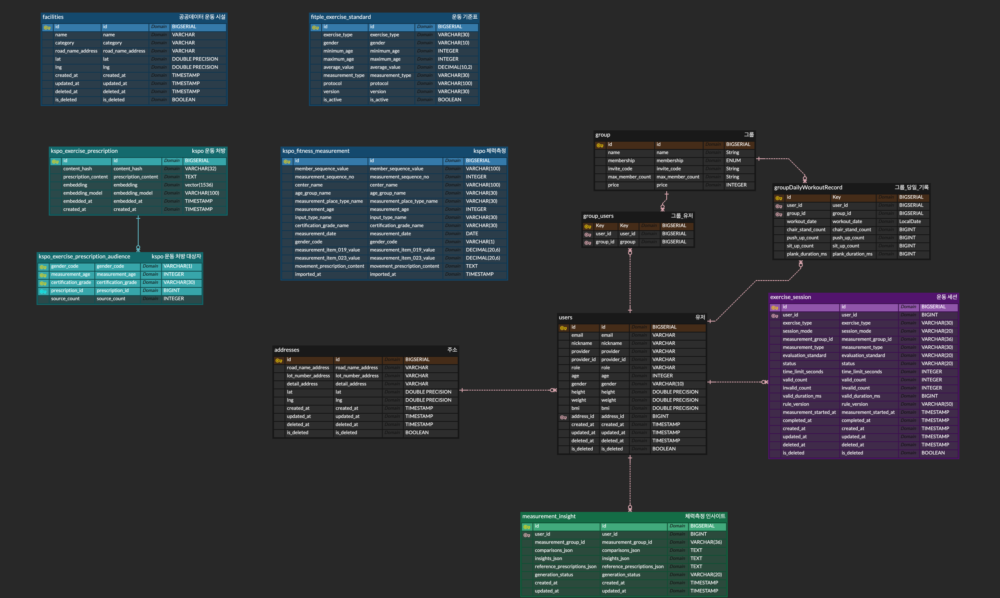

# FITTLE Back-end Repository (2026 SKU 해커톤 최우수상 수상🏆️) 🏋️
---
"카메라 하나로 내 운동을 분석하고, **AI 맞춤 운동처방**을 받는 서비스"
 
**FITTLE**의 백엔드 저장소입니다.
 

 

---

## ✨ 핵심 기능

### 🚀 서비스 흐름
- 로그인 및 프로필 등록 → 체력 측정 → 실시간 자세 분석 → 측정 결과 확인 → AI 맞춤 운동 추천
- 개인 운동 기록과 그룹 운동 현황을 관리하고, 사용자 위치를 기반으로 주변 공공 체육시설 탐색

### 🔐 인증 및 회원 관리
- **OAuth 기반 소셜 로그인/회원가입 구현**
    - Google, Kakao 간편 로그인 지원
- **JWT 기반 인증 구조**
    - Access Token / Refresh Token 이중 토큰 방식 적용
    - Refresh Token Rotation으로 자동 로그인 및 보안성 강화

### 🤸 실시간 운동 자세 분석
- **WebSocket 기반 실시간 포즈 분석**
    - 브라우저의 MediaPipe WASM이 관절 좌표(Landmark)를 추출해 서버로 전송
    - 일회용 WebSocket 티켓으로 세션을 검증하고, 서버에서 관절 각도·동작 단계·횟수·유지 시간을 계산
    - 계산된 횟수, 유지 시간, 자세 피드백과 세션 상태를 프론트에 실시간 반환
- **지원 운동 종류**
    - 푸시업(Push-up), 윗몸일으키기(Sit-up), 플랭크(Plank), 스쿼트(Squat)
- **목적에 따른 세션 분리**
    - `MEASUREMENT`: 의자앉았다일어서기 → 푸시업 → 윗몸일으키기 → 플랭크 순서로 체력을 측정
    - 반복 운동은 제한시간이 끝나면 자동 완료되며, 중단된 측정은 동일 그룹과 운동부터 재개 가능
    - `WORKOUT`: 제한시간 없이 개별 운동을 수행하고 사용자가 직접 종료하며, 플랭크는 자세가 무너지면 자동 완료

### 📊 체력 측정 및 평가
- **공공데이터와 FITTLE 기준을 결합한 체력 평가**
    - 의자앉았다일어서기·윗몸일으키기는 국민체력100 데이터, 푸시업·플랭크는 FITTLE 연령대·성별 기준 사용
    - 운동별 측정값과 동연령대 평균을 비교해 `낮음`·`비슷함(±10%)`·`높음`으로 분류
- **측정 결과 분석**
    - 오늘을 포함한 최근 완료 측정 5회를 운동별 횟수와 플랭크 유지 시간으로 제공
    - 동일 성별·연령대 사용자의 최신 완료 기록을 기반으로 백분위와 막대그래프용 분포 데이터 제공
    - 비교 표본이 30명 이상일 때 백분위를 계산하고, 전체 운동 점수와 가장 유사한 수행 연령대·성별 제공

### 🤖 AI 운동처방 (RAG)
- **국민체육진흥공단 운동처방 데이터 활용**
    - 공공데이터 JSON을 Flyway 배치로 정제·적재하고 연령·성별·체력 기준과 처방을 연결
- **pgvector + OpenAI Embedding 기반 유사도 검색**
    - `text-embedding-3-small`로 처방을 임베딩하고, 사용자 측정 결과와 유사한 후보를 검색
    - 운영 애플리케이션과 분리된 일회성 Compose 배치로 임베딩을 초기화하며 중단 지점부터 재개 가능
- **GPT-4o-mini 기반 인사이트 생성**
    - 연령·성별·운동별 달성률과 검색된 공단 처방을 바탕으로 친근한 맞춤 운동 3개 생성
    - 생성 결과를 측정 그룹별로 저장해 재조회 시 OpenAI API를 다시 호출하지 않음

### 🗺️ 주변 운동시설 조회
- **위치 기반 반경 5km 이내 시설 목록 제공**
    - Haversine 공식 기반 거리 계산 및 거리순 정렬 반환
    - 조회 결과 Redis 24시간 캐시로 응답 속도 최적화

### 📅 운동 캘린더 & 기록 관리
- **날짜별 운동 기록 조회**
    - 월별 운동 완료 일수·달성률과 날짜별 완료 운동 종류 수 제공
    - 오늘을 포함한 최근 7일의 운동 완료 여부 조회
- **그룹별 일일 운동량 누적**
    - 그룹 가입 이후 완료된 `WORKOUT` 기록만 그룹별·사용자별·날짜별로 집계
    - 의자앉았다일어서기·푸시업·윗몸일으키기는 총횟수, 플랭크는 총 유지 시간으로 누적

### 👥 운동 그룹
- **2~5인 운동 그룹 생성 및 참여**
    - 내가 속한 그룹과 멤버 목록 조회, 방장 그룹 삭제 및 멤버 탈퇴 지원
    - 초대 코드·링크를 통한 가입과 OAuth 로그인 이후 자동 참여 흐름 지원

### 🛠️ 데이터 및 운영
- PostgreSQL 16 + pgvector와 Redis 7을 Docker Compose로 구성
- 시설 데이터 초기화와 처방 임베딩을 메인 서버 기동과 분리된 일회성 배치로 실행
- Flyway 기반 스키마·기준 데이터 관리, Actuator·Prometheus 기반 상태 및 메트릭 확인

---

## ⚙ 기술 스택
|    파트    |                                                   기술                                                    |
|:--------:|:-------------------------------------------------------------------------------------------------------:|
| BackEnd  | Java 17, Spring Boot 3.5.3, Spring Security, OAuth2, JWT, JPA, WebSocket, OpenFeign, Flyway, AOP, P6Spy |
| DataBase |                                    PostgreSQL 16 + pgvector, Redis 7                                    |
|    AI    |                          OpenAI API (gpt-4o-mini, text-embedding-3-small), RAG                          |
|  Infra   |                               Docker, Terraform, AWS EC2, SSM, CloudWatch                               |
|  CI/CD   |                                       GitHub Actions, Docker Hub                                        |
|   etc.   |                                        Swagger, Notion, Discord                                         |

---

## 💁‍♂️ 프로젝트 팀원

<table>
<tr>
<td align="center" style="width: 150px; padding: 10px;">
 
<b><a href="https://github.com/hyeonkangkimm">김현강</a></b> 

실시간 운동 자세 분석 및 운동별 자세·횟수 판정 로직 
체력 측정 모드 , 개별 운동 모드 
AI 맞춤 운동 추천 , RAG 기반 임베딩·유사도 검색 

</td>
<td align="center" style="width: 150px; padding: 10px;">
 
<b><a href="https://github.com/catomat0">김동국</a></b> 

소셜 로그인, 인프라 세팅 
운동시설-지도  
그룹 초대 기능  

</td>
<td align="center" style="width: 150px; padding: 10px;">
 
<b><a href="https://github.com/rkdehdrbs7885-oss">강동균</a></b> 

개인 캘린더 월별 운동 기록 및 달성률 조회 
그룹 캘린더 월별 운동 기록 
 

</td>
</tr>
</table>

---

## 🧺 ETC.

### ERD 구조

 

### 아키텍처

 

### 설계 원칙
도메인형 패키지 구조를 기반으로, 비즈니스 로직과 핵심 데이터 패키지를 분리한 구조입니다. 
[컨벤션 정리](https://wiry-tuck-17c.notion.site/3d43538f6f54803aaa31d5348da33d1a?source=copy_link)
